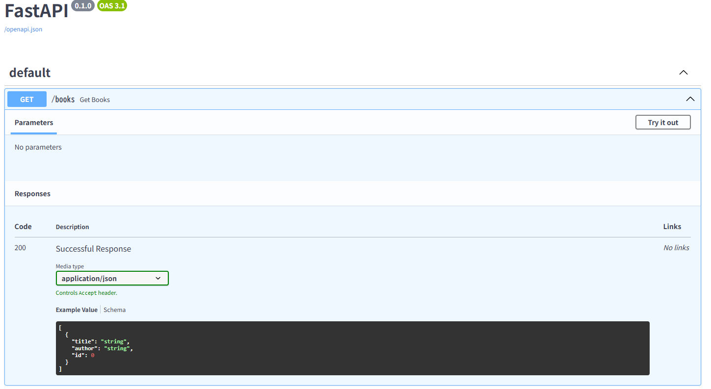
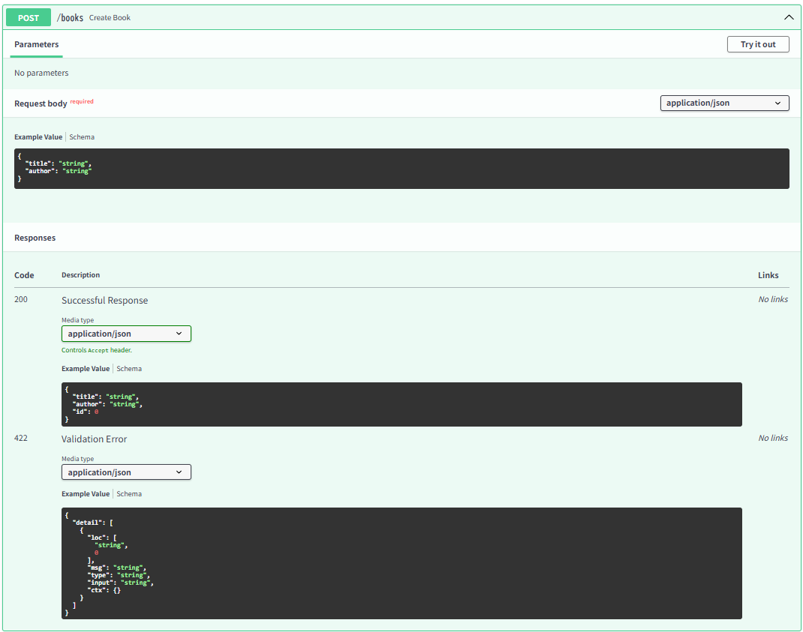

# Reading Tracker API

読書管理用のバックエンドAPIです。
FastAPI + PostgreSQL + Docker を用いて構築しています。

---

## ■ 概要

本の登録・一覧取得ができるAPIです。
Dockerで環境構築できるようにしています。

---

## ■ 技術スタック

* Python
* FastAPI
* SQLAlchemy
* PostgreSQL
* Docker

---

## ■ 機能

* 本の登録（POST /books）
* 本一覧取得（GET /books）

---

## ■ 起動方法

```bash
docker compose up --build
```

---

## ■ API確認

http://localhost:8000/docs

## ■ API画面




---

## ■ 設計

* Router / Model / Schema / Database に分割
* シンプルな責務分離を意識
* Dockerにより環境差異を排除

---

## ■ 今後の改善

* 本の詳細取得（GET /books/{id}）
* 更新・削除機能（CRUD対応）
* 認証機能（JWT）
* フロントエンド追加
